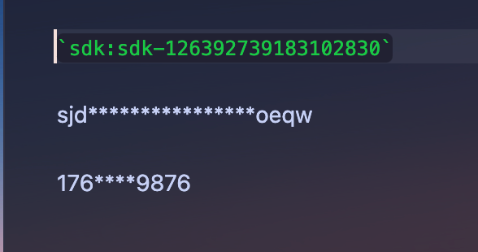

# Secret Mask

Obsidian 插件：隐藏敏感信息（手机号、SDK、密钥等任意字符串）的中间部分，悬浮和复制时显示完整值。



## 用法

在笔记中用反引号包裹 `sdk:` 前缀 + 任意字符串（数字、字母、符号均可）：

```markdown
`sdk:17612343234`
`sdk:sdk-126392739183102830`
`sdk:sjdlajsdlajsdlaksguoeqw`
```

阅读视图中分别显示为：

```
176****3234
sdk***************1830
sjd****************oeqw
```

> 值的长度若 ≤ 前几位 + 后几位之和（默认 3 + 4 = 7），会原样显示不屏蔽。

## 行为

| 场景 | 表现 |
| --- | --- |
| 阅读视图 | 显示掩码 |
| 编辑视图（光标不在上面） | 显示掩码 |
| 编辑视图（点进去） | 自动还原源码，可正常编辑 |
| 悬浮 | 显示完整值 |
| 复制 | 只复制纯文本，值完整，不带格式 |

## 设置

- **Prefix digits**：前面显示的位数（默认 3）
- **Suffix digits**：后面显示的位数（默认 4）
- **Mask character**：掩码字符（默认 `*`）

## 开发

```bash
npm install
npm run dev    # 开发模式（watch，改完自动构建 main.js）
npm run build  # 生产构建（含类型检查）
```

把本仓库软链到仓库的插件目录即可调试（**目录名必须与 `manifest.json` 的 `id` 一致**）：

```bash
ln -s "$PWD" "/path/to/vault/.obsidian/plugins/secret-mask"
```

改完后在 Obsidian 里重载插件；也可安装社区插件 **Hot Reload** 自动重载。

## 文件说明

- `main.ts`：插件逻辑
- `manifest.json`：插件元数据（id / 版本 / 最低支持版本等）
- `versions.json`：版本与最低 App 版本映射，Obsidian 更新时用
- `esbuild.config.mjs`：构建脚本
- `.github/workflows/release.yml`：打 tag 后自动构建 + 发 Release

## 发布到 Obsidian 插件市场

插件由官方社区目录 [community.obsidian.md](https://community.obsidian.md) 收录；用户安装时，Obsidian 会从**你的 GitHub Release 资产**里拉取 `main.js` / `manifest.json` / `styles.css`。

### 一、发布前的准备

1. 代码推到一个**公开**的 GitHub 仓库。
2. `manifest.json` 字段要写全，`version` 用语义化版本。
3. 仓库里保留 `README.md`、`LICENSE`。
4. Release 资产必须是这三个文件（文件名精确匹配，不要只放 zip）：
   - `main.js`
   - `manifest.json`
   - `styles.css`（没有样式可省略）

### 二、自动化发版（本仓库已配置）

流程：本地打 tag → push → GitHub Actions 自动构建并创建 Release。

```bash
# 1. 改版本号：同时改 manifest.json 和 package.json 的 version
# 2. 打 tag（tag 名要与 manifest.json 的 version 一致，推荐不带 v）
git tag 1.0.0
git push origin 1.0.0
```

推送 tag 后，`.github/workflows/release.yml` 会：
1. `npm install && npm run build`
2. 创建对应 tag 的 Release
3. 把 `main.js`、`manifest.json`、`styles.css` 作为资产上传

> 也可以直接用 GitHub 网页手动创建 Release 并拖入这三个文件。

### 三、提交到插件市场（一次性）

通过官方社区目录提交：

1. 注册并登录 <https://community.obsidian.md>（用 Obsidian 账号）。
2. 在个人资料里绑定 GitHub 账号，用于验证仓库归属。
3. 确保默认分支 HEAD 上的 `manifest.json` 正确且已提交，并且对应的 GitHub Release 已创建。
4. 在目录里「添加插件」，选择你的仓库地址。
5. 官方自动审核 + 人工审核，按提示修改；需要改动就用**递增的新版本号**重新发 Release。

前提：仓库 public，根目录有 `README.md` 和 `LICENSE`，`manifest.json` 的 `id` 全局唯一且不能包含 `obsidian`。

### 四、截图

插件列表页会渲染你仓库的 README，相对路径图片会被自动解析到仓库文件。截图**不是硬性要求**，但强烈建议加，用户才能直观看到效果：

```markdown

```

把图片放到仓库 `images/` 目录（建议 1~2 张，宽度控制在 ~1000px）。

### 五、后续更新版本

只需重复「二、自动化发版」：改版本号 → 打新 tag → push。市场会自动读取最新 Release，用户端收到更新提示，无需重新提交。

## 校验清单

- [ ] 仓库为 public，根目录有 `README.md` 和 `LICENSE`
- [ ] `manifest.json` 的 `id` 全局唯一，不含 `obsidian`
- [ ] Release tag == `manifest.json` 的 `version`
- [ ] Release 资产含 `main.js`、`manifest.json`（有样式再加 `styles.css`）
- [ ] `main.js` 是构建产物（不要提交源码 TS 当产物）
